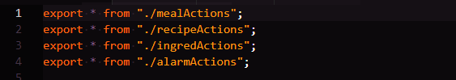

# Part 1 - Individual Accomplishments this Week
- Paste your team’s github contribution graph here and indicate your Github Handle:

I am @abravebee.

- Provide a paragraph (5-8 sentences) summarizing the work you did this week, the challenges you faced, the tools you used, and your accomplishments

This week I spent a lot of time verbally discussing the project with my team members, as well as working on design/layout and boilerplating Redux and folder/file structure to best suit our needs and reduce merge conflicts. One of the biggest challenges I faced personally was trying to balance communication with my team and actually building pieces of the project. I mainly spent time in Figma and refreshing/building with Redux when I wasn't discussing the project with my teammates. 

I also spent a considerable amount of time hashing out our data models, deploying the front-end to Netlify, and helping to debug deployment of the back-end to Heroku. I am most pleased with the Netlify deployment and with becoming more comfortable with Redux again (as I have not worked with it since the week we learned it). I look forward to having a better grasp of the Labs workflow next week and cleaning/dividing up our Trello board better so I can increase the amount I'm able to get done each day.

## Tasks Pulled
List the tasks you pulled this week, and provide a link to the successfully merged PR completing that task and the trello card for that task.  You must have at least one front end and one back end. The expected total is 6 with a minimum of 4.

- Front End
1. Deployment to Netlify
  - Github: https://github.com/Lambda-School-Labs/Labs8-MealHelper/pull/4
  - Trello: https://trello.com/c/0yLt3IF9/12-deployed-to-the-web-front-end
2. Redux Boilerplate
  - Github: https://github.com/Lambda-School-Labs/Labs8-MealHelper/pull/11
  - Trello: https://trello.com/c/9z6NUrMX/11-frontend 
3. Deployment Bug fix
  - Github: https://github.com/Lambda-School-Labs/Labs8-MealHelper/pull/13
  - Trello: https://trello.com/c/0yLt3IF9/12-deployed-to-the-web-front-end
Back End
1. Deployment to Heroku debugging
  - Github: https://github.com/Lambda-School-Labs/Labs8-MealHelper/pull/20
  - Trello: https://trello.com/c/qE0np4cb/36-deployed-to-the-web-back-end

Detailed Analysis
Pick one of your tickets and provide a detailed analysis of the work you did.  This should be approximately ¼ page of text, and at least three screenshots.

In past projects, I've had a tendency to use few files and folders when building. This meant putting the bulk of my code in index.js files rather than breaking them out by category or route or what-have-you. I think this was a side-effect mainly of my nerves when working under a time crunch, and assuming it was better to just get the code down and then organize it later--this is the way I've worked as a creative/non-fiction writer, so it was instinctive to use this method while writing code. However, since I am not the only one who needs to understand the structure of the code, it seemed prudent to put some time and thought into setting up a file/folder structure that would allow us to work as a team without conflicting with one another.

I was also aware that I'm not the only one on the team who was feeling rusty on Redux, so it seemed like a model could only be helpful As I had to spend some time refreshing on Redux anyway, I decided to start with actions and reducers (which took longer than expected). There was a clear pattern with our meals, ingredients, alarms, and recipes pages, so I started there:

Originally I had set it up with the GET/GETTING pattern I was familiar with from Dustin's lectures. However, as you can see toward the bottom, I had a thought about a possible different structure. I remembered a groupmate from my cohort who had condensed their actions ending in "ING" down to FETCHING_DATA or something similar. I wondered if this might be useful to us, and suggested it in a comment to go over with my teammates.

I also started setting up a couple of actions (one pictures above) to model our other actions after. I included a commented out example of what it would look like if we changed our action types. This is still under discussion.

Other actions files did not have as much detail, just the comment headings, but I did include how these files would be exported from index.js so that we wouldn't have to worry about pathnames when pulling action types for different components. Everything can be imported from the index.js file by exporting with the example shown above, and importing into reducer files as shown below.

And as with the actions, I had some thoughts about the reduction of our reducers from the examples I was used to. These discussion were briefly tabled when we realized that we needed to build log-in functionality as opposed to simple deployment! But I did include example code with commented out alternatives using the second version of initial state:

I look forward to spending more time implementing this structure into actual functionality!

Part 2 - Milestone Reflections
Put your response to the weekly question and a link to your team journal assignment here.
Front End deployment: https://lambdamealhelper.netlify.com/
Back End deployment: https://labs8-meal-helper.herokuapp.com/users
We ran into a bug very late in the day regarding the back-end deployment and as such were unable to finish wiring up the register/login on the deployed site. It does work locally, however, and my hope is that we'll be able to finish this part up by demo time.